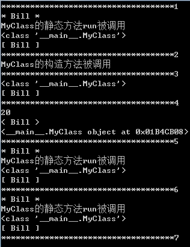

##### 静态方法、类方法和实例方法
在实例方法中，可以调用静态方法和类方法，反之，不成立
```python
class MyClass:
    name = 'Bill'   # 静态变量
    def __init__(self):
        print('MyClass的构造方法被调用')
        self.value =20
    # 定义静态方法
    @staticmethod
    def run():
        print('*',MyClass.name, '*')
        print('MyClass的静态方法run被调用')
        MyClass.do()
    # 定义类方法
    @classmethod
    def do(self):
        print(self)
        print('[',self.name,']')      
    # 实例方法
    def do1(self):
        print(self.value)
        print('<', self.name, '>')
        print(self)
print("************************************1")
# 调用静态方法
MyClass.run()
print("************************************2")
c = MyClass()
print("************************************3")
c.do()
print("************************************4")
c.do1()
print("************************************5")
c.run()
print("************************************6")
MyClass.run()
print("************************************7")
```


